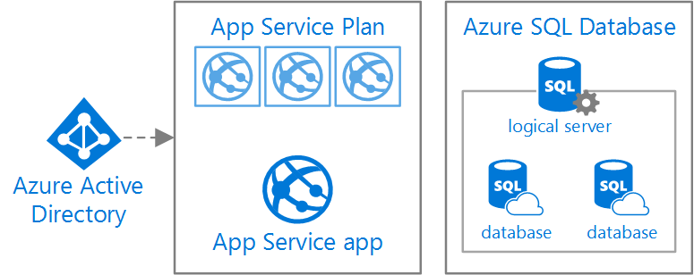
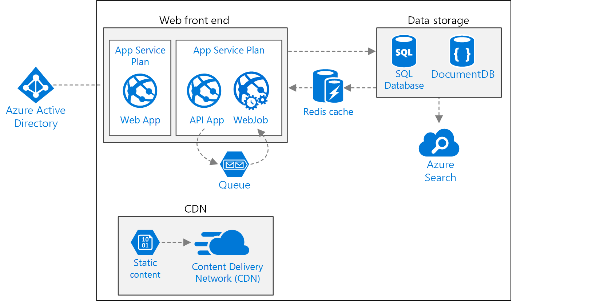
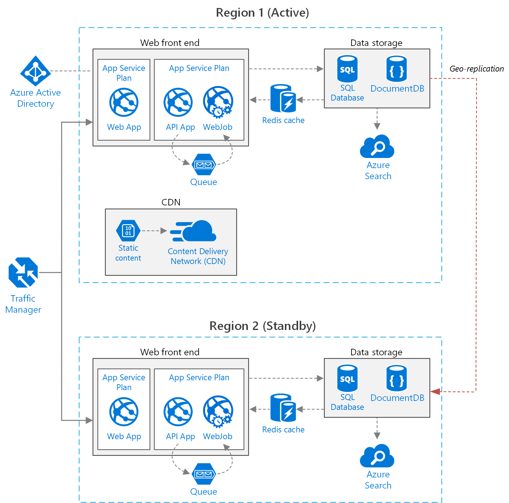

# Web application architectures for Azure App Service

[!INCLUDE [pnp-branding](../_includes/header.md)]

Azure App Service is a fully managed cloud service for hosting web applications, mobile app back ends, and web APIs. However, most applications require more than just a web tier. For example, a typical application may use a data tier, cache, and CDN. Other considerations include deployment, diagnostics, monitoring, and multi-region deployments for high availability.

The patterns & practices group has created a set of reference architectures to address these scenarios. Each reference architecture includes:

* An architecture diagram, showing the components that make up the architecture.
* Recommendations and best practices.
* Considerations for availability, security, scalability, and manageability.

This article gives a summary of each reference architecture, and helps you to decide which solution will best meet your needs.

## Basic web application
This architecture describes a basic web application that uses Azure SQL Database for the data tier and Azure Active Directory for authentication.  

This architecture is a good starting point for a traditional web application that works with relational data. However, it has some limitations in terms of scalability and high availability, that are addressed in the next two architectures.   

For detailed information about this architecture, see [Basic web application](basic-web-app.md).

## Web application architecture for scalability
This architecture adds some components that are designed to improve your application's performance under load:

* Separate web API and WebJob to perform queued tasks.
* Azure Redis Cache to cache semi-static data or session state.
* Azure CDN to cache static content.
* Multiple data stores, including relational and document-oriented databases.
* Azure Search for storing searchable indexes. 

For detailed information about this architecture, see [Web application architecture for scalability](scalable-web-app.md).

## Web application architecture for high availability
This architecture is deployed to two regions to achieve higher availability, using Azure Traffic Manager to route Internet requests to the application. 

During normal operations, Traffic Manager routes requests to the primary region. If the application running that region becomes unavailable, Traffic Manager fails over to the secondary region.

The data stores are geo-replicated to the secondary region.

For detailed information about this architecture, see [Web application architecture for high availability](multi-region-web-app.md).

